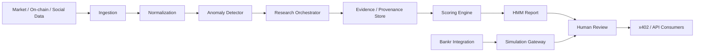

# Highly Motivated Machine (HMM)

> **Autonomous intelligence with trust issues.**  
> **Trust me, bro. HMM will check.**

**Status:** Portfolio / pre-MVP design  
**Ticker concept:** `$HMM`  
**Project type:** Agentic AI + crypto market intelligence + API/data engineering + on-chain integration

## What is HMM?

Highly Motivated Machine (HMM) is a portfolio-grade software engineering project for an autonomous crypto-intelligence system. It detects unusual market activity, investigates potential catalysts, scores evidence, distinguishes hype from fundamentals, and produces explainable market-intelligence reports.

The project's personality is intentionally crypto-native: **“Trust Me Bro”** is the cultural wrapper; **HMM** is the serious engineering system underneath it.

The core rule is simple:

> **Do not trust the narrative. Verify the evidence.**

HMM is designed around three analytical layers:

- **Hype** — attention, sentiment, searches, social velocity, narrative acceleration.
- **Metrics** — market data, volume, wallets, transactions, TVL, revenue, developers.
- **Mechanics** — liquidity, token supply, unlocks, funding, OI, liquidations, exchange flows, and value capture.

## Portfolio goals

This repository is intended to demonstrate practical skills in:

- Python software engineering
- REST API integration
- data ingestion and normalization
- anomaly detection
- multi-agent / agentic workflows
- retrieval and evidence provenance
- confidence scoring
- API design
- blockchain integration
- security and secrets management
- architecture documentation
- testing and CI/CD
- technical product design
- responsible deployment controls

## Safety-first development

The project begins in **research and simulation mode**. Any Bankr token-launch integration must default to `simulateOnly: true`. No live token deployment, fee movement, treasury execution, or transaction broadcasting should occur through the portfolio demo without an explicit production configuration and human approval.

Bankr's current token-launch API supports simulation that returns a predicted token address and fee distribution without broadcasting a transaction. The architecture deliberately uses that capability for portfolio demonstrations.

## Repository map

```text
.
├── README.md
├── .env.example
├── pyproject.toml
├── docs/
│   ├── product/
│   │   ├── PROJECT_CHARTER.md
│   │   ├── PRD.md
│   │   └── ROADMAP.md
│   ├── architecture/
│   │   ├── HLD.md
│   │   ├── LLD.md
│   │   └── DATA_MODEL.md
│   ├── adr/
│   │   ├── ADR-001-simulation-first.md
│   │   ├── ADR-002-evidence-provenance.md
│   │   └── ADR-003-modular-providers.md
│   ├── security/
│   │   └── THREAT_MODEL.md
│   ├── portfolio/
│   │   ├── CASE_STUDY.md
│   │   └── DEMO_PLAN.md
│   └── whitepaper/
│       └── WHITEPAPER_DRAFT.md
├── src/hmm_core/
│   ├── __init__.py
│   └── models.py
└── tests/
    └── test_models.py
```

## Planned MVP flow



## Example output

```text
HMM ALERT

Asset: EXAMPLE
Volume anomaly: 3.8x 7-day baseline
Price confirmation: +7.2%
Social acceleration: High
Network activity: Mixed
Confirmed catalyst: None

SideEye:
Narrative is moving faster than verified fundamentals.

Receipts:
2 secondary sources
0 primary confirmations

Confidence: 41%

HMM...
Interesting trade setup. Weak investment evidence.
```

## Initial development milestones

1. Define canonical data contracts.
2. Implement provider adapters.
3. Build historical baselines and anomaly detection.
4. Add evidence/provenance storage.
5. Build research-orchestration workflow.
6. Implement Hype / Metrics / Mechanics scoring.
7. Expose results through an API.
8. Add x402 monetization experiment.
9. Add Bankr simulation adapter.
10. Build dashboard/demo and publish engineering case study.

## Disclaimer

HMM is an experimental software engineering and research project. It is not investment advice, does not guarantee trading outcomes, and should not represent probabilistic outputs as certainty.
