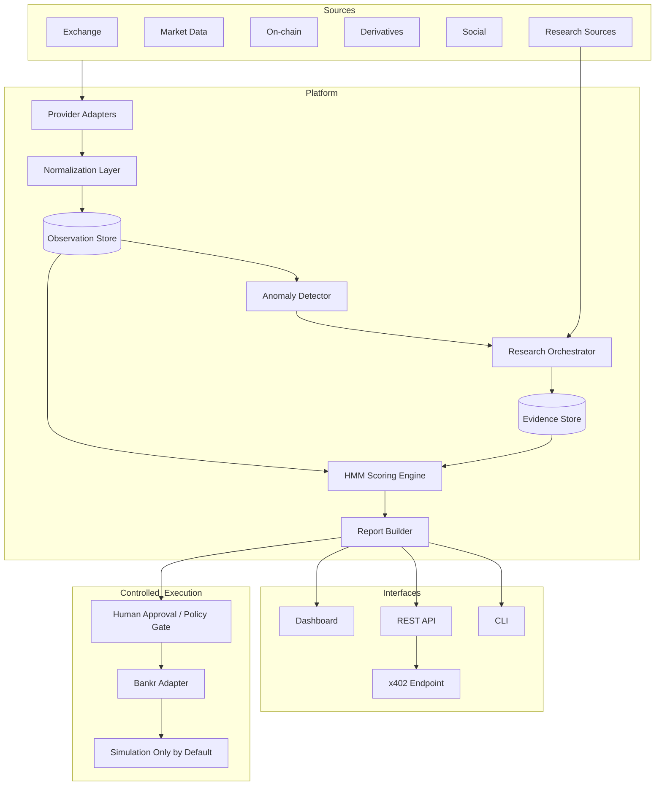

# High-Level Design

## Architecture goals
HMM should be modular, auditable, provider-agnostic, and safe to demonstrate without financial execution.

## Key design principles
1. **Detection before narrative.**
2. **Evidence before confidence.**
3. **Independent scores instead of one opaque rating.**
4. **Provider abstraction to avoid vendor lock-in.**
5. **Financial execution isolated from analytical code.**
6. **Simulation-first by default.**
7. **Humans remain in the approval path for irreversible actions.**
