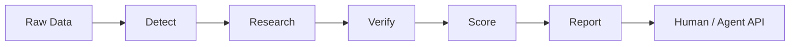

# Highly Motivated Machine
## Autonomous Intelligence With Trust Issues
### White Paper — Draft 0.1

**Token concept:** `$HMM`  
**Cultural motif:** *Trust me, bro. HMM will check.*

> This is an initial engineering white-paper draft, not a final token-offering document.

## Abstract
Highly Motivated Machine (HMM) is a proposed autonomous crypto market-intelligence network designed to detect abnormal activity, investigate causal narratives, preserve evidence provenance, and expose structured intelligence to humans and software agents.

Crypto markets combine transparent on-chain activity with fragmented off-chain information, reflexive social behavior, leverage, thin liquidity, and rapidly changing narratives. HMM is designed around skepticism rather than prediction certainty.

Its analytical model separates **Hype**, **Metrics**, and **Mechanics**, allowing speculative momentum to be identified without automatically treating attention as fundamental adoption.

## 1. The “Trust Me Bro” Problem
Crypto markets contain abundant claims but inconsistent verification. Price movement often creates its own explanation after the fact. HMM treats an unsupported explanation as a hypothesis, not a catalyst.

## 2. Design philosophy
1. Detect before explaining.
2. Prefer primary evidence.
3. Preserve timestamps and provenance.
4. Separate trading momentum from investment quality.
5. Represent uncertainty explicitly.
6. Never manufacture a catalyst.
7. Keep execution subordinate to policy and human approval.

## 3. HMM analytical framework

### Hype
Measures attention and reflexivity:
- social acceleration;
- searches;
- sentiment;
- narrative velocity;
- influencer concentration;
- attention relative to price.

### Metrics
Measures observable activity:
- volume;
- wallets;
- transactions;
- holders;
- TVL;
- fees/revenue;
- developer activity.

### Mechanics
Measures market/token structure:
- liquidity;
- supply/FDV;
- unlocks/emissions;
- exchange flows;
- open interest;
- funding;
- liquidations;
- token value capture.

## 4. Intelligence pipeline

## 5. Evidence and catalyst classification
Candidate catalysts are classified as:
- **Confirmed** — primary evidence exists and timing aligns;
- **Probable** — credible evidence exists but causation remains unproven;
- **Speculative** — plausible but weakly supported;
- **None found** — no reliable catalyst identified.

## 6. Agent economy
A future HMM service may expose machine-readable intelligence through paid API endpoints, including x402-compatible services. Economic sustainability should come from useful services first rather than relying solely on token speculation.

## 7. Token concept
`$HMM` is exploratory. A token should not be launched merely because launch infrastructure exists.

Before final token design, the project should establish:
- demonstrable product utility;
- user demand;
- treasury policy;
- fee accounting;
- legal/compliance review;
- token-value-capture rationale;
- disclosure standards;
- security controls.

Potential roles may be explored for access, coordination, or protocol participation, but no mechanism should promise returns or imply guaranteed appreciation.

## 8. Bankr integration
The engineering design includes a Bankr adapter for experimentation with agent-economy infrastructure. Portfolio demonstrations use the provider's simulation capability so a predicted deployment result can be inspected without broadcasting a transaction.

## 9. Security
HMM treats external content as untrusted, separates research from execution, protects secrets, resolves assets by network/contract identity, and requires stronger approval controls as actions become less reversible.

## 10. Roadmap
- scanner and canonical data model;
- anomaly detection;
- research orchestration;
- evidence provenance;
- HMM scoring;
- API/dashboard;
- paid machine-to-machine intelligence experiment;
- controlled token/treasury research;
- production-readiness and legal/security review.

## 11. What HMM is not
HMM is not:
- an oracle of future prices;
- a guaranteed alpha engine;
- an excuse to fabricate catalysts;
- an unsupervised trading bot;
- a substitute for risk management.

## 12. Closing thesis
The cryptoverse already has enough systems saying **“trust me, bro.”**

HMM is designed to answer:

**“Hmm. Show me the receipts.”**
